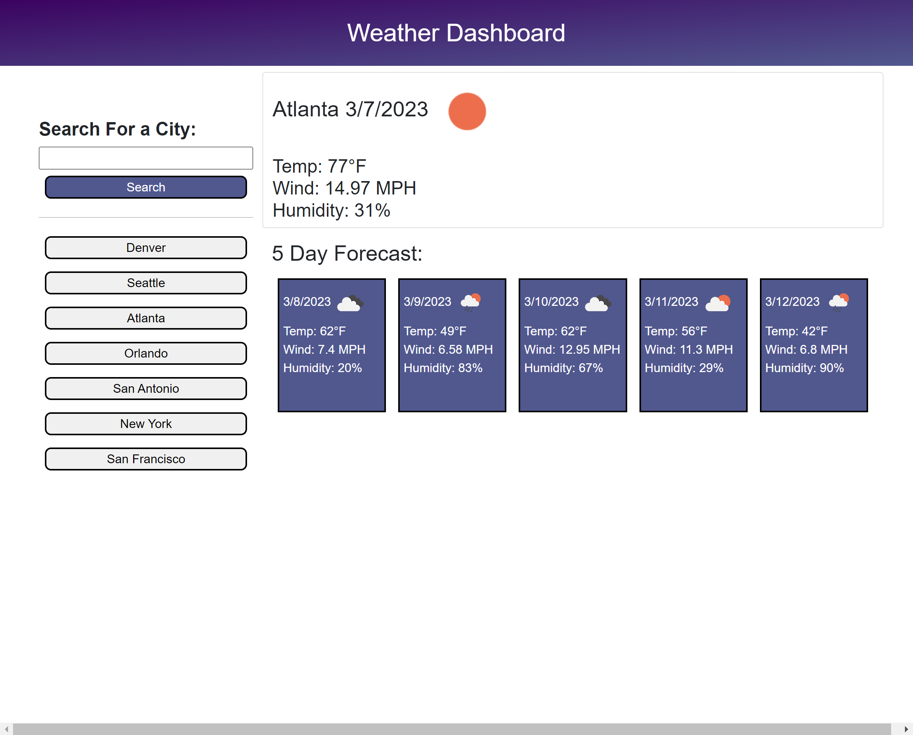

# [Weather Dashboard](https://alyssageria.github.io/weather-dashboard/)

## Description

The purpose of this assignment was to create a functional weather dashboard that displays the current weather, as well as the next fives days forecast. This website was made with HTML, Bootstrap, CSS, JavaScript and jQery.

## Usage

This webpage consists of an area for the user to search for any city they would like to see the weather for. Their search history is listed below with buttons so they are able to navigate to their previously searched cities. I used an open weather API that provides the current and the next five days forecast.

